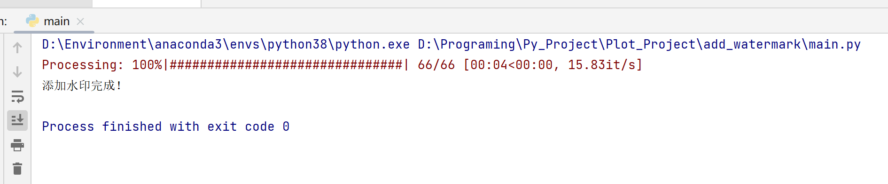
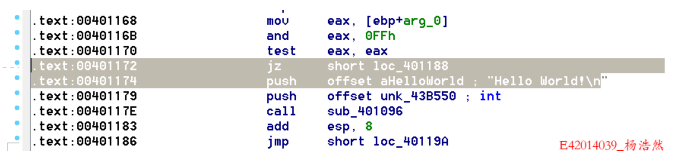
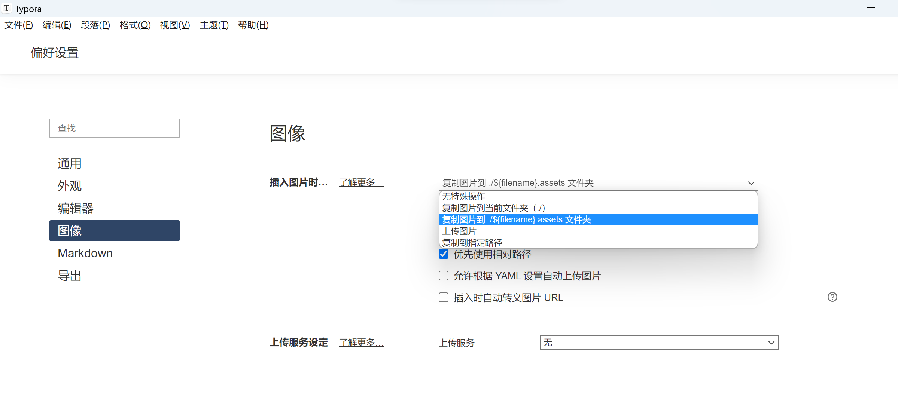

# 批量添加水印代码

**`开发者：llw,yhr,yyh,zjy`**

## 功能说明

该代码实现了对指定文件夹下所有JPEG和PNG格式的图片添加水印文字，并将处理后的图片保存到指定目录中。

遍历原始图片所在的文件夹，找到文件名以`.jpg`或`.png`结尾的图片文件，依次添加水印，并将添加水印后的图片保存到指定目录。

添加水印时，程序会根据原始图片的大小自动计算合适的文字大小，水印位置固定在图片的右下角。

## 使用方法

### 第三方包

该程序需要以下Python库的支持：`Pillow、tqdm、shutil`。安装命令如下：

```bash
pip install -r requirements.txt -i http://mirrors.aliyun.com/pypi/simple/ --trusted-host mirrors.aliyun.com
```

### 修改程序配置参数

在程序开头，有一些配置参数需要根据实际情况进行修改，包括：

- `text`：水印文字内容。可以根据需要将其修改为任何字符串。
- `font_path`：水印字体文件路径。默认使用宋体字体，如果需要使用其他字体，需要将其修改为正确的字体文件路径。
- `color`：水印颜色。默认为红色。
- `scale`：水印文字大小与原始图片大小之比。默认为0.1，即水印文字大小为原始图片大小的10%。
- `source_dir`：原始图片所在的文件夹路径。需要将其修改为实际的文件夹路径。
- `target_dir`：添加水印后的图片保存路径。需要将其修改为实际的文件夹路径。注意：如果指定的目录不存在，程序会尝试创建它。

### 运行程序

程序开始运行后，会在命令行中显示一个进度条，表示程序正在逐个处理每一张图片。处理完成后，程序会输出一条提示信息，表示已经成功添加水印。

### 查看结果

执行完程序后，你可以前往指定的目标文件夹，查看处理后的图片是否已经被正确保存并添加水印。


示例图如下：


## 注意事项

1. 该程序只能处理`.jpg`和`.png`格式的图片文件，其他格式可以自行添加；
2. 在添加水印时，程序会根据原始图片大小自动计算文字大小和位置，但也可能出现不理想的效果。如果需要更精细的控制，可以修改`font_size`和`position`变量；
3. 对于一些特殊情况（如指定的文件夹不存在，或者程序无法打开某一个图片文件等），程序会输出错误信息到命令行并停止运行。如果遇到这种情况，请根据提示修复问题后再次尝试。

## 与Typora配套使用
给Typora进行如下设置，将文档中的所有图片暂存在.assets文件夹并优先使用相对路径。

之后，用程序操作会非常方便。